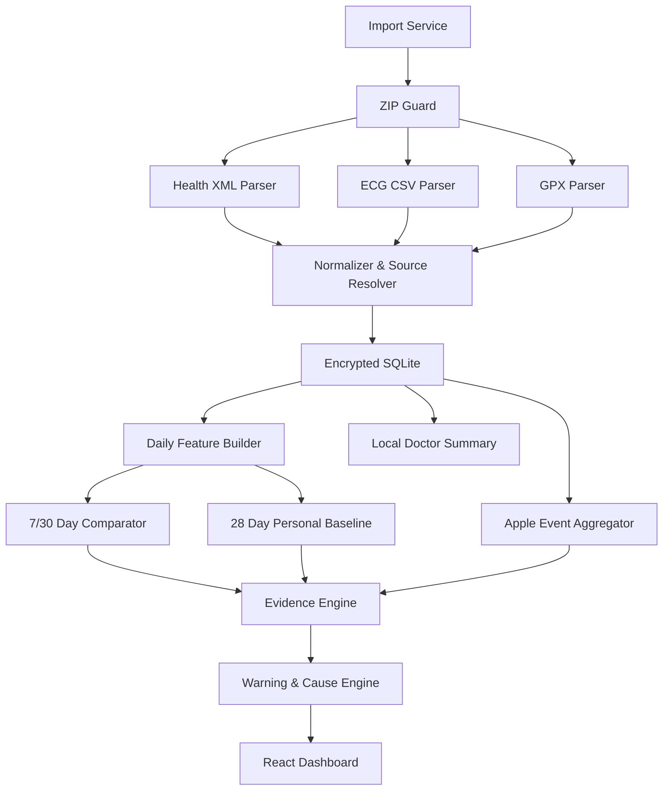

# Apple Watch 健康数据分析软件 V2 方案

## 1. 目标与结论

本软件应实现为一款 **Windows 本地桌面健康趋势分析工具**：用户定期把 Apple“健康”导出的完整 ZIP 拖入软件，软件自动识别版本、增量合并历史数据、计算最近 7 天和 30 天分布、渲染图表、发现值得复核的变化，并给出可解释的可能原因和安全建议。

核心定位：

- 发现趋势、变化和数据缺口，不替代医生诊断。
- 优先使用 Apple 原始事件和个人历史基线，不用单次测量制造警报。
- 警示必须给出“证据、可能原因、测量局限、下一步”，不能只显示红色分数。
- 全部健康数据默认只在本机处理，不上传云端、不用于广告、不写入普通日志。
- 后续开发以本方案为准。

## 2. 用户完整流程


导入后的默认首页直接回答四个问题：

1. 最近 7 天发生了什么变化？
2. 最近 30 天是否形成持续趋势？
3. 哪些只是测量或数据问题，哪些值得继续观察或咨询医生？
4. 每条提示依据了哪些数据，用户下一步可以做什么？

## 3. Apple 官方背景与产品边界

### 3.1 数据和导入方式

Apple 官方说明，“健康”App 可以导出全部健康与健身数据为 XML。HealthKit 使用预定义的数据类型，并保留样本的来源、设备、起止时间和元数据；多个设备和 App 可能同时贡献数据。因此本软件必须处理多来源合并，而不能简单把所有步数或距离直接相加。

当前导出包还暴露了几个实际工程要求：

- 主 XML 文件名是本地化的中文名称，部分 ZIP 库显示为乱码，不能写死 `export.xml`。
- 应通过 ZIP 条目类型、文件体量和 XML 根节点 `HealthData` 识别主数据文件。
- ECG CSV 表头是中文，必须支持本地化表头或按结构识别。
- 每次导出是完整历史快照，重复导入会包含大量旧记录，因此必须幂等去重。
- 导出包中的百分比可能用小数保存，例如血氧 `0.95` 应显示为 `95%`；房颤负荷 `0.02` 应按 Apple 展示语义处理为 `2% 或更低`，不能直接显示 `0.02%`。
- 导出当天可能只有半天数据，比较算法必须自动排除未完成日。

### 3.2 心率通知

Apple 的高/低心率通知是在用户静止至少约 10 分钟、心率持续高于或低于用户设置阈值时形成。当前导出包的事件元数据显示：

- 高心率阈值：100 次/分；
- 低心率阈值：50 次/分；
- 每条原始事件窗口长度：10 分钟。

因此软件必须把相邻的 10 分钟窗口合并为一个事件段，并进一步按同一夜晚汇总。不能把 38 个窗口写成“38 次独立发作”。

### 3.3 ECG 与房颤负荷

Apple Watch ECG 类似单导联 I 导联。Apple 明确说明它不能检测心梗、血栓或卒中，也不能检测所有心脏疾病；现实环境中也会出现不可分类或记录质量不佳的结果。

软件应：

- 原样展示 Apple 的 ECG 分类，不自行重新诊断。
- 将“记录不佳”优先解释为需要重测和检查佩戴，而不是心律异常。
- 对房颤负荷只展示 Apple 导出值、数据覆盖和周趋势。
- 不建议用户根据软件自行停药、加药或改变治疗。

### 3.4 睡眠分数

Apple 公开的睡眠分数为 0–100，主要由三部分构成：睡眠时长 50 分、入睡时间一致性 30 分、睡眠中断 20 分；一致性参考最近 13 晚。

当前导出包没有可直接复用的 Apple 睡眠分数记录。因此本软件可以生成 **“本地估算睡眠分”**，但必须：

- 明确标注“非 Apple 官方分数、非医学评分”。
- 显示三项子分及扣分原因。
- 不声称复现 Apple 未公开的完整映射公式。
- 数据不足时不出分数，只显示缺失原因。

### 3.5 血氧、腕温和夜间生命体征

Apple 明确将血氧、腕温和 Vitals 的相关测量定位为健康/健身参考，而非医学诊断。血氧和光学心率还可能受皮肤灌注、寒冷、动作、佩戴松紧、纹身等影响。软件只能分析趋势和个人基线，不应根据单次血氧或腕温自动给出疾病结论。

### 3.6 睡眠呼吸扰动

Apple 的睡眠呼吸暂停通知会在 30 天内收集足够夜晚，并判断是否持续出现较高呼吸扰动；它不是睡眠呼吸暂停的确诊工具，也可能漏检。软件可展示 Apple 原始通知和趋势，但不能自行把原始扰动数值转换成睡眠呼吸暂停诊断。

## 4. 算法验证策略

公开仓库不保存或展示任何真实用户健康数据。算法使用人工构造、不可回溯到个人的测试记录验证以下行为：

- 未结束的当天不混入完整日同比；
- 7/30 天窗口只比较等长且有足够覆盖的数据；
- 睡眠区间、锻炼区间与心率事件按时间重叠关系交叉验证；
- 单点异常不会直接生成诊断，证据不足时明确降低结论强度；
- 多次导入同一快照保持幂等，不重复累计记录；
- 缺失指标保持缺失，不插值伪造健康读数。

### 4.1 可公开复现的场景

| 场景 | 输入特征 | 预期行为 |
| --- | --- | --- |
| 睡眠不足 | 连续多日睡眠缩短，其他指标稳定 | 提示睡眠趋势，但不推断疾病 |
| 夜间低心率 | 低心率事件与睡眠区间重叠 | 标注发生场景，并提示结合症状复核 |
| 恢复信号同步偏离 | HRV、静息心率与睡眠同时偏离个人基线 | 提高证据强度，展示各项贡献 |
| 稀疏血氧 | 少量且不连续的血氧样本 | 不生成连续趋势或低氧诊断 |
| 重复导入 | 相同记录再次出现 | 更新导入摘要，健康记录不重复写入 |

### 4.2 安全解释边界

- 如果出现胸痛、明显呼吸困难、晕厥、严重头晕、意识异常或卒中表现，应立即联系当地急救服务。
- 没有紧急症状时，软件只建议保存趋势和上下文，供用户与专业人员沟通。
- 不根据手表或本软件自行停用、增加或调整药物。
- 腕部设备读数会受到佩戴、动作、温度和设备状态影响，必须结合趋势与场景理解。

## 5. 数据导入和增量合并架构

### 5.1 ZIP 安全检查

导入前必须完成：

- 文件签名和 ZIP 结构检查，拒绝损坏文件。
- 限制条目数量、单条解压大小、总解压大小和压缩比，防止 ZIP bomb。
- 禁止目录穿越，绝不按 ZIP 内路径直接写文件系统。
- XML 解析关闭外部实体和网络访问，防止 XXE。
- ECG 和 GPX 只通过流读取，不默认产生明文临时目录。

### 5.2 导入事务

1. 计算 ZIP 哈希并创建导入批次。
2. 在临时数据库表中流式解析。
3. 完成结构、数量、日期和单位校验。
4. 全部成功后再一次性提交；中断或失败则回滚。
5. 保留原 ZIP 只读，不修改原文件。

### 5.3 幂等去重

Health 导出 XML 不一定提供可依赖的稳定 UUID，因此建立标准化指纹：

```text
record_fingerprint = hash(
  type + source + device + start_utc + end_utc + normalized_value + normalized_unit + selected_metadata
)
```

数据库记录 `first_seen_import`、`last_seen_import` 和 `content_hash`。再次导入完整历史 ZIP 时：

- 已存在记录更新 `last_seen_import`，不新增。
- 新记录增量写入。
- 只有在完整导入成功后，才把最新版中缺失的旧记录标记为“可能已在 Health 中删除”；不立即物理删除。

### 5.4 多来源合并

- 心率、血氧、呼吸、腕温：优先设备原始样本，并保留来源标签。
- 静息心率、HRV、VO₂ max 等 Apple 派生日指标：直接使用导出记录，不从原始心率重复推算。
- Move、Exercise、Stand：优先 `ActivitySummary`。
- 步数和距离：按时间区间去重；重叠区间按用户可见的来源优先级选择，非重叠区间可合并。
- 软件必须提供“来源与覆盖”页面，任何汇总值均可追溯。

### 5.5 时间和单位

- 内部时间统一存 UTC，同时保留原始时区；日界线按记录当地时区计算。
- 自动识别未完成日，默认不用于日同比和基线。
- 保存原始数值、原始单位和标准化值，支持算法升级后重算。
- 百分比、kJ/kcal、公里/米和温度必须经过显式单位映射和测试。

## 6. 7/30 天分析算法

### 6.1 窗口定义

- 最近 7 天：最后 7 个完整自然日。
- 对照 7 天：紧邻其前的 7 个完整自然日。
- 最近 30 天：最后 30 个完整自然日。
- 对照 30 天：紧邻其前的 30 个完整自然日。
- 页面还提供 90 天和全部历史，但警示默认以 7/30 天为主。

### 6.2 数据充分性

- 7 天趋势至少需要 5 个有效日。
- 30 天趋势至少需要 21 个有效日。
- 个人基线至少需要 14 个有效日，推荐使用最近 28 个有效日。
- 数据不足、来源冲突或当天未完成时，只显示“数据提示”，不得升级为健康警示。

### 6.3 统计方法

- 中心趋势：中位数为主，均值辅助。
- 波动：IQR/MAD 为主，避免单个极端值控制结论。
- 个人偏离：相对最近 28 个有效日的中位数和 MAD。
- 周/月变化：使用等长完整窗口，显示绝对变化和相对变化。
- 每条结论同时显示有效样本数、覆盖率和最后数据时间。

### 6.4 事件合并

- 先读取 Apple 事件阈值和每个 10 分钟窗口。
- 时间相邻或间隔很短的窗口合并为“事件段”。
- 同一睡眠夜的多个事件段再汇总成“该夜低心率/高心率概况”。
- 保留三个数字：涉及夜晚数、事件段数、原始 10 分钟窗口数。
- 事件卡默认展示汇总，不用几十条重复红色警告轰炸用户。

### 6.5 场景标签

每个事件自动标记：

- 睡眠中 / 清醒；
- 运动中 / 运动后 / 非运动；
- 当天数据完整 / 未完整；
- 手表佩戴覆盖是否充分；
- 是否与 ECG、症状、呼吸变化、血氧变化或腕温变化同日；
- 是否为新出现、持续存在或已恢复。

## 7. 睡眠分数和原因解释

### 7.1 本地估算睡眠分

建议沿用 Apple 公开的三维权重作为易懂结构：

- 时长：50%；
- 一致性：30%；
- 中断：20%。

但界面必须命名为“本地估算睡眠分”。计算细节版本化，并在详情页公开：

- 时长子分：实际睡眠与用户睡眠目标比较；没有目标时，成人默认参考 7 小时并提示用户确认。
- 一致性子分：参考最近 13 个有效夜晚的入睡时间，用跨午夜的圆周时间差计算。
- 中断子分：夜间清醒总时长、清醒段数及其相对个人 28 日基线。
- 数据不足 5 晚、分期缺失严重或手表覆盖不足时不出总分。

### 7.2 低分原因卡

原因按实际贡献排序，例如：

```text
本周睡眠偏低
主要原因 1：平均睡眠 5小时22分，低于你的 7 小时目标
主要原因 2：最近 13 晚入睡时间波动约 51 分钟
次要原因：夜间中断与上周相近，不是主要下降来源
```

### 7.3 可能原因库

可能原因只能以“可以考虑/可能相关”呈现：

- 作息改变、夜班、旅行或环境噪声/光线/温度。
- 压力、焦虑或近期生活事件。
- 下午或晚间咖啡因、尼古丁、酒精。
- 临睡前大餐、电子设备或过晚高强度运动。
- 疼痛、发热、感染、某些药物。
- 打鼾、憋醒、喘气、明显日间困倦等睡眠呼吸暂停线索。
- 手表电量不足、佩戴过松或睡眠追踪未覆盖完整夜晚。

软件应让用户勾选近期因素，形成可供医生参考的睡眠日记；不能从时间相关性直接声称因果。

## 8. 心率和其他健康提示规则

### 8.1 高心率

先验证：Apple 阈值、持续时间、是否处于运动、原始心率样本、佩戴质量、是否伴随症状。

可解释的非诊断性因素包括：运动后恢复、压力/焦虑、疼痛、发热、脱水、睡眠不足、咖啡因、酒精、吸烟以及某些药物。需要专业排查的可能性包括感染、贫血、甲状腺问题、心律失常、心肺疾病或电解质问题。

只有“重复、持续、与个人基线明显不同或伴随症状”时才升级，不因一个孤立高值直接报警。

### 8.2 低心率

先区分睡眠期、运动员/体能较好状态和清醒期。睡眠中或体能较好者低于 60 次/分可能并不异常。

需要结合医生评估的可能因素包括：影响心率的药物、甲状腺功能偏低、睡眠呼吸暂停、心脏传导问题、心肌或心脏疾病、电解质异常等。软件只能列出可能性，不能从手表数据选择其中一种。

当前数据的规则示例：

- 不是显示“38 次低心率警报”；
- 而是显示“4 个完整睡眠夜出现低于 50 的持续窗口，最近两晚更集中；最低观察值约 44；建议结合症状和医生意见复核”。

### 8.3 血氧

- 单次低值先检查动作、寒冷、皮肤灌注、佩戴松紧和纹身影响。
- 需要看多夜趋势、有效样本数和症状，不使用一刀切阈值自动诊断低氧。
- 若出现明显呼吸困难、胸痛/胸闷、嘴唇或面部发青、意识异常等，应根据症状及时就医，不等待手表复测。
- 若用户需要医学判断，建议使用获准的医疗设备并咨询医生。

### 8.4 HRV、静息心率、呼吸和腕温

这些指标优先做个人基线偏离，不与别人比较。Apple 也提示药物、海拔、酒精、疾病等会影响夜间生命体征。软件只有在多个指标同时偏离且覆盖充分时才显示“综合状态变化”，并明确它仍然不是疾病诊断。

### 8.5 ECG 与房颤负荷

- ECG 分类完全保留 Apple 原文。
- “记录不佳”给出重测指导，不升级为心律异常。
- 房颤负荷按周展示数据覆盖和 Apple 显示档位。
- 任何胸痛、胸部压迫/紧缩、呼吸困难、晕厥或卒中表现都走紧急症状流程；不能因为 ECG 显示窦性心律就排除紧急情况。

## 9. 警示分层

| 层级 | 含义 | 触发示例 | 软件动作 |
| --- | --- | --- | --- |
| 灰色：数据问题 | 数据不足或可能失真 | 当天未结束、手表覆盖不足、来源冲突 | 不解释健康原因，先说明如何补数据 |
| 蓝色：观察 | 单次或轻微偏离 | 一个孤立窗口、轻度基线偏离 | 加入趋势，建议继续观察 |
| 黄色：需要调整 | 可解释的持续生活方式趋势 | 多日睡眠不足、作息波动、活动下降 | 给出可执行的安全建议和日记入口 |
| 橙色：建议专业复核 | 重复 Apple 事件、新出现的持续模式或多指标共同异常 | 连续数晚低心率、反复非运动高心率、持续 Apple 呼吸暂停通知 | 汇总证据，建议预约医生，不给疾病结论 |
| 红色：紧急症状 | 用户确认存在紧急症状 | 胸痛/压迫、严重呼吸困难、晕厥、卒中表现等 | 明确提示立即联系当地急救；中国大陆 120 |

红色层级不能仅凭手表数值自动触发。橙色卡片打开时应主动询问用户是否存在紧急症状，再决定是否进入红色流程。

## 10. 原因解释引擎

每条警示生成四段内容：

1. **观察到什么**：窗口、数值、基线、覆盖和事件持续时间。
2. **最可能先检查什么**：佩戴、运动、睡眠、药物、酒精/咖啡因、压力、发热等。
3. **还有哪些医学可能性**：只列权威资料支持的类别，并标注“无法由本数据判断”。
4. **下一步**：继续观察、改善习惯、记录症状、预约医生或紧急就医。

原因排序规则：

- 与时间上下文直接匹配的因素优先，例如事件与睡眠重叠。
- 用户主动记录的因素高于算法猜测。
- 多指标共同变化提高关注度，但不自动证明因果。
- 测量伪差必须始终作为候选原因。
- 不显示超过 3 个主要原因，其他原因放在“更多可能性”中。

## 11. 图表方案

### 首页

- 时间切换：7 天 / 30 天 / 90 天 / 全部。
- 顶部状态卡：睡眠、心脏与恢复、活动、数据可信度。
- 中间：最近变化时间线，黄色/橙色提示按优先级排序。
- 底部：数据覆盖日历和导入状态。

### 睡眠页

- 每晚睡眠时长柱图和目标线。
- 睡眠阶段堆叠时间轴。
- 13 晚入睡时间一致性图。
- 睡眠分三项贡献图，不只显示总分。
- 心率、呼吸、血氧、腕温与睡眠对齐图。

### 心脏页

- 静息心率与 HRV 分开绘制，避免双轴误导。
- 高/低心率事件段时间线，标记睡眠、运动和症状。
- 28 日个人基线带和有效数据点。
- ECG 列表、波形查看、Apple 分类和记录质量。
- 房颤负荷周趋势及覆盖说明。

### 活动页

- Move / Exercise / Stand 日趋势。
- 步数、距离和活动来源覆盖。
- 运动次数、类型、时长、配速、心率和路线。
- 精确路线默认隐藏，在线地图底图默认关闭。

所有图表必须显示日期范围、单位、有效日数、来源和“数据截至”时间；禁止 3D 图、隐蔽截断坐标轴和不解释的双轴。

## 12. 技术架构

推荐：**Tauri 2 + React + TypeScript + Rust + SQLite/SQLCipher + ECharts/Canvas**。



建议增加以下表：

- `imports`、`import_entries`、`import_errors`；
- `health_records_raw`、`health_records_normalized`；
- `record_sources`、`source_preferences`；
- `daily_features`、`sleep_nights`、`personal_baselines`；
- `apple_event_windows`、`health_event_episodes`；
- `workouts`、`workout_routes`；
- `ecg_records`、`ecg_samples`；
- `warning_evidence`、`warnings`、`user_context_notes`；
- `medical_reference_rules`、`algorithm_versions`。

每条警示保存算法版本、输入数据哈希、证据快照和来源链接，以便以后解释“为什么当时出现这条提示”。

## 13. 隐私和安全

- 默认完全离线，禁止隐式遥测。
- 数据库使用静态加密；密钥由 Windows 安全存储保护。
- 原 ZIP、数据库、缓存、报告和临时文件分别管理，支持一键彻底删除。
- 普通日志不得包含姓名、生日、精确位置、原始 ECG、症状文本或完整健康数值。
- 医生报告默认移除精确路线和设备昵称。
- 任何联网地图、云备份或 AI 云解释都必须单独、逐次获得用户明确同意。
- 若未来开发 iPhone/HealthKit 版本，按数据类型逐项请求权限，并清楚解释用途；不得将 HealthKit 数据用于广告、出售给数据经纪商或未经明确同意提供给第三方。

## 14. 实施路线

### 阶段 A：导入底座

- Tauri/React 工程、加密数据库和 ZIP 拖放。
- 支持中文/乱码文件名识别、XML/CSV/GPX 流式解析。
- 导入事务、幂等去重、单位和时区标准化。
- 导入历史和数据覆盖页。

### 阶段 B：分析底座

- 完整日识别、7/30 天等长比较。
- 日级特征、28 日个人基线、MAD/IQR。
- Apple 高/低心率窗口合并和睡眠夜汇总。
- 本地睡眠分三项解释。

### 阶段 C：页面和警示

- 首页、睡眠、心脏、活动与数据质量页面。
- 灰/蓝/黄/橙/红五级流程。
- 原因解释、用户因素勾选和安全建议。
- ECG 波形、房颤负荷和医生沟通摘要。

### 阶段 D：验证和安装包

- 用匿名化测试包覆盖边界情况。
- 与仅保存在本机、不会进入源码仓库的测试包核对记录、事件和窗口结果。
- 性能、导入中断、数据库迁移、加密、删除和无网络测试。
- Windows 安装包和首次使用隐私说明。

## 15. 验收标准

1. 支持拖入 ZIP 和文件选择器导入。
2. 同一完整导出包重复导入不产生重复记录。
3. 新导出包只增加新数据，并正确处理最新版中消失的记录。
4. 自动排除未完成日，7/30 天窗口使用等长完整周期。
5. 当前包应复现：最近 7 天平均睡眠约 5.36 小时、38 个低心率 10 分钟窗口、5 个高心率窗口。
6. 低心率窗口必须汇总为睡眠夜/事件段，不能生成 38 张独立警报卡。
7. 本地睡眠分能明确指出时长、一致性和中断各自贡献。
8. 每条警示都有数据证据、可能原因、测量局限和下一步。
9. 手表数值本身不能触发红色紧急提示；必须结合用户确认的紧急症状。
10. ECG 不被软件重新分类，Apple 原始分类始终可见。
11. 所有核心数值显示单位、有效样本数、来源和截至时间。
12. 默认无网络请求，精确路线默认隐藏，日志不泄露健康数据。

## 16. 权威资料基础

### Apple 官方

- [从“健康”App 导出全部健康数据为 XML](https://support.apple.com/guide/iphone/iph5ede58c3d/ios)
- [HealthKit 数据类型](https://developer.apple.com/documentation/healthkit/data-types)
- [HealthKit 隐私保护要求](https://developer.apple.com/documentation/healthkit/protecting-user-privacy)
- [Apple Watch 心脏健康与高/低心率通知](https://support.apple.com/guide/watch/apde39f5426c/watchos)
- [Apple Watch ECG 的能力和限制](https://support.apple.com/120278)
- [Apple Watch 房颤历史](https://support.apple.com/108375)
- [Apple Watch 睡眠追踪和睡眠分数](https://support.apple.com/108906)
- [Apple Watch 睡眠呼吸暂停通知](https://support.apple.com/120031)
- [Apple Watch 夜间生命体征](https://support.apple.com/120142)
- [Apple Watch 血氧测量和限制](https://support.apple.com/120358)
- [Apple Watch 测量准确性与佩戴因素](https://support.apple.com/105002)
- [Apple Watch 腕温测量和限制](https://support.apple.com/guide/watch/apd526d20feb/watchos)

### 医疗与公共卫生资料

- [American Heart Association：心动过速及可能原因](https://www.heart.org/en/health-topics/arrhythmia/about-arrhythmia/tachycardia--fast-heart-rate)
- [American Heart Association：心动过缓、例外情况和症状](https://www.heart.org/en/health-topics/arrhythmia/about-arrhythmia/bradycardia--slow-heart-rate)
- [American Heart Association：何时呼叫急救](https://www.heart.org/en/health-topics/house-calls/when-to-call-911)
- [CDC：成人睡眠时长和健康睡眠习惯](https://www.cdc.gov/sleep/about/index.html)
- [NHLBI：失眠的原因和风险因素](https://www.nhlbi.nih.gov/health/insomnia/causes)
- [NHLBI：睡眠呼吸暂停及症状](https://www.nhlbi.nih.gov/health/sleep-apnea)
- [FDA：血氧仪的准确性限制和症状优先原则](https://www.fda.gov/consumers/consumer-updates/pulse-oximeter-basics)

这些资料用于限制软件的表达和行动建议，不用于把消费级可穿戴设备变成医疗诊断设备。正式面向他人销售或用于临床前，需要另行进行医疗器械、隐私和本地法规评估。
